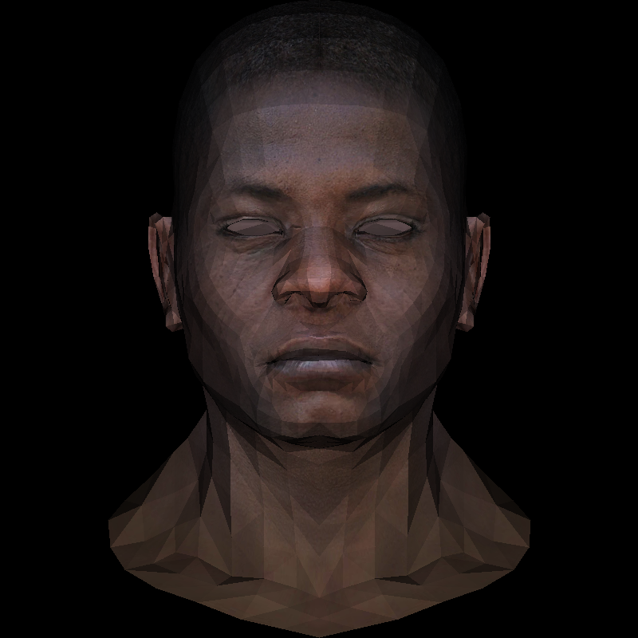

# tinyrenderer
building a bare-bones renderer according to tinyrenderer by Dmitry V. Sokolov

## Lesson 1
Wireframe renderings of 3D models

## Lesson 2
Filled triangle renderings with visual artifacts

## Lesson 3
Backface culling with Z-buffers

with texture mapping

## Lesson 5
Gouraud shading

